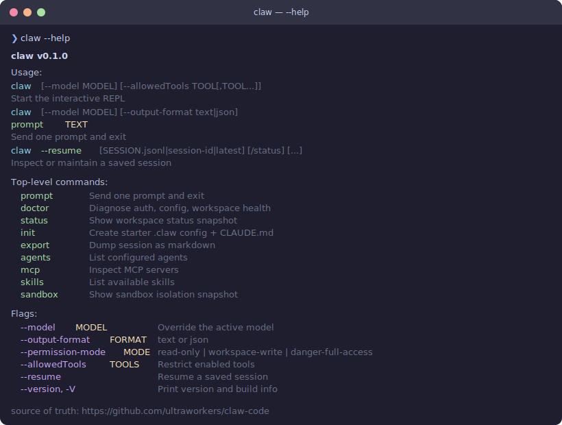
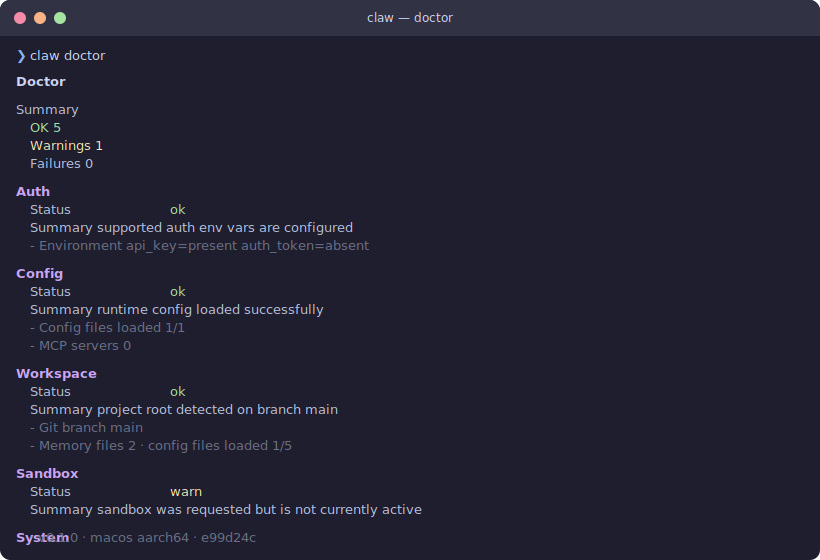
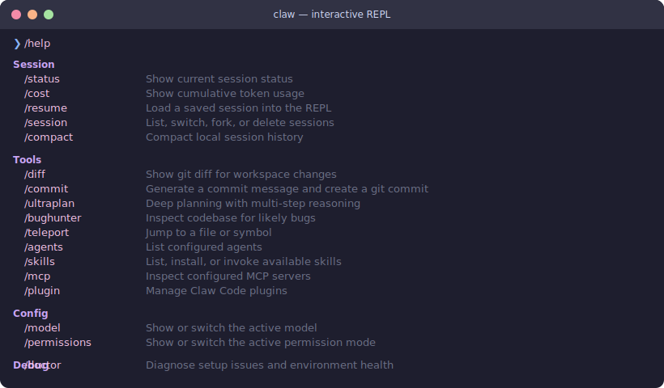

# 🦞 Claw Code — Rust CLI

<p align="center">
  
</p>

<p align="center">
  <strong>A high-performance Rust rewrite of the Claw Code CLI agent harness.</strong><br/>
  Built for speed, safety, and native tool execution.
</p>

<p align="center">
  <a href="https://github.com/ultraworkers/claw-code">GitHub</a>
  ·
  <a href="../USAGE.md">Usage Guide</a>
  ·
  <a href="../PARITY.md">Parity Status</a>
  ·
  <a href="../ROADMAP.md">Roadmap</a>
  ·
  <a href="https://discord.gg/5TUQKqFWd">Discord</a>
</p>

---

## Screenshots

### `claw --help` — CLI surface at a glance

<p align="center">
  
</p>

### `claw doctor` — Pre-flight health check

<p align="center">
  
</p>

### Interactive REPL — Slash commands

<p align="center">
  
</p>

---

## Quick Start

```bash
# 1. Clone and build
git clone https://github.com/ultraworkers/claw-code
cd claw-code/rust
cargo build --workspace

# 2. Set your API key
export ANTHROPIC_API_KEY="sk-ant-..."

# 3. Health check — always run this first
./target/debug/claw doctor

# 4. Interactive REPL
./target/debug/claw

# 5. One-shot prompt
./target/debug/claw prompt "explain this codebase"

# 6. JSON output for automation
./target/debug/claw --output-format json prompt "summarize src/main.rs"
```

> [!WARNING]
> **Do not run `cargo install claw-code`.** The `claw-code` crate on crates.io is a deprecated stub. Build from source (this repo) instead.

> [!NOTE]
> **Auth:** `claw` requires an **API key** (`ANTHROPIC_API_KEY`, `OPENAI_API_KEY`, etc.) — Claude subscription login is not a supported auth path.

---

## Installation

### From source (recommended)

```bash
git clone https://github.com/ultraworkers/claw-code
cd claw-code/rust
cargo build --workspace
```

The binary is at `target/debug/claw` (macOS/Linux) or `target\debug\claw.exe` (Windows).

### Installer script

```bash
# Debug build (fast, default)
./install.sh

# Release build (optimized)
./install.sh --release
```

### Container

```bash
podman build -t claw-code -f Containerfile .
podman run -it -v .:/workspace claw-code
cd rust && cargo build --workspace
```

### Add to PATH (optional)

```bash
# Symlink (macOS/Linux)
ln -s $(pwd)/target/debug/claw /usr/local/bin/claw

# Or cargo install from local path
cargo install --path crates/rusty-claude-cli --force

# Or add to shell profile
echo 'export PATH="'$(pwd)'/target/debug:$PATH"' >> ~/.zshrc
```

---

## Authentication

### Anthropic (direct API)

```bash
export ANTHROPIC_API_KEY="sk-ant-..."
```

### Bearer token (OAuth / proxy)

```bash
export ANTHROPIC_AUTH_TOKEN="your-bearer-token"
```

### OpenAI-compatible (OpenRouter, Ollama, etc.)

```bash
export OPENAI_BASE_URL="https://openrouter.ai/api/v1"
export OPENAI_API_KEY="sk-or-v1-..."
claw --model "openai/gpt-4.1-mini" prompt "hello"
```

### xAI (Grok)

```bash
export XAI_API_KEY="xai-..."
claw --model grok prompt "hello"
```

### Alibaba DashScope (Qwen)

```bash
export DASHSCOPE_API_KEY="sk-..."
claw --model "qwen-plus" prompt "hello"
```

### Provider matrix

| Provider | Auth env var | Base URL env var | Protocol |
|---|---|---|---|
| **Anthropic** | `ANTHROPIC_API_KEY` or `ANTHROPIC_AUTH_TOKEN` | `ANTHROPIC_BASE_URL` | Anthropic Messages |
| **xAI** | `XAI_API_KEY` | `XAI_BASE_URL` | OpenAI-compatible |
| **OpenAI-compat** | `OPENAI_API_KEY` | `OPENAI_BASE_URL` | OpenAI Chat Completions |
| **DashScope** | `DASHSCOPE_API_KEY` | `DASHSCOPE_BASE_URL` | OpenAI-compatible |

---

## CLI Commands

### Top-level commands

```
claw                           Start the interactive REPL
claw prompt "text"             Send one prompt and exit
claw "text"                    Shorthand non-interactive prompt
claw doctor                    Diagnose auth, config, workspace health
claw status                    Show workspace status snapshot
claw init                      Create starter .claw config + CLAUDE.md
claw export [path]             Dump session as markdown
claw agents                    List configured agents
claw mcp                       Inspect MCP servers
claw skills                    List available skills
claw sandbox                   Show sandbox isolation snapshot
claw system-prompt             Render the assembled system prompt
claw --resume latest           Resume the most recent session
```

### Flags

```
--model MODEL                  Override the active model (aliases: opus, sonnet, haiku, grok)
--output-format text|json      Machine-readable JSON output
--compact                      Strip tool details; print only final text (pipe-friendly)
--permission-mode MODE         read-only | workspace-write | danger-full-access
--allowedTools TOOLS           Restrict enabled tools (comma-separated)
--resume SESSION               Resume a saved session (.jsonl, session-id, or "latest")
--version, -V                  Print version and build info
```

### Model aliases

| Alias | Resolves to | Provider |
|-------|-------------|----------|
| `opus` | `claude-opus-4-6` | Anthropic |
| `sonnet` | `claude-sonnet-4-6` | Anthropic |
| `haiku` | `claude-haiku-4-5-20251213` | Anthropic |
| `grok` | `grok-3` | xAI |
| `grok-mini` | `grok-3-mini` | xAI |

Any unrecognized model name is passed through verbatim — use this for OpenRouter slugs, Ollama tags, or full model IDs.

---

## Interactive REPL

Start the REPL with `claw` (no arguments). Tab completion expands slash commands, model aliases, and session IDs.

### Slash commands

#### Session & visibility

| Command | Description |
|---------|-------------|
| `/help` | Show available slash commands |
| `/status` | Current session status |
| `/cost` | Cumulative token usage |
| `/resume <session>` | Load a saved session |
| `/session list\|switch\|fork\|delete` | Manage sessions |
| `/compact` | Compact session history |
| `/clear` | Start a fresh session |
| `/version` | CLI version and build info |
| `/export [file]` | Export conversation to markdown |
| `/stats` | Workspace and session statistics |

#### Workspace & git

| Command | Description |
|---------|-------------|
| `/diff` | Show git diff for workspace changes |
| `/commit` | Generate commit message and create a git commit |
| `/pr [context]` | Draft or create a pull request |
| `/issue [context]` | Draft or create a GitHub issue |
| `/init` | Create a starter CLAUDE.md |
| `/config` | Inspect config files or merged sections |
| `/memory` | Inspect loaded instruction files |

#### Discovery & analysis

| Command | Description |
|---------|-------------|
| `/ultraplan [task]` | Deep planning with multi-step reasoning |
| `/bughunter [scope]` | Inspect codebase for likely bugs |
| `/teleport <symbol>` | Jump to a file or symbol |
| `/agents` | List configured agents |
| `/skills` | List, install, or invoke skills |
| `/mcp` | Inspect MCP servers |
| `/plugin` | Manage plugins (install, enable, disable) |
| `/doctor` | Diagnose environment health |
| `/subagent` | List, steer, or kill sub-agents |

#### Model & permissions

| Command | Description |
|---------|-------------|
| `/model [model]` | Show or switch the active model |
| `/permissions [mode]` | Show or switch permission mode |
| `/providers` | List available model providers |

---

## Features

| Feature | Status |
|---------|--------|
| Anthropic / OpenAI-compatible provider flows + streaming | ✅ |
| Multi-provider support (Anthropic, xAI, OpenAI-compat, DashScope) | ✅ |
| Direct bearer-token auth via `ANTHROPIC_AUTH_TOKEN` | ✅ |
| Interactive REPL with tab completion (rustyline) | ✅ |
| Tool system (bash, read, write, edit, grep, glob) | ✅ |
| Web tools (search, fetch) | ✅ |
| Sub-agent / agent delegation | ✅ |
| Task registry (create, get, list, stop, update, output) | ✅ |
| Team + cron runtime | ✅ |
| MCP server lifecycle + inspection | ✅ |
| LSP client integration | ✅ |
| Todo tracking | ✅ |
| Notebook editing | ✅ |
| CLAUDE.md / project memory | ✅ |
| Config file hierarchy (`.claw.json` + merged sections) | ✅ |
| Permission system (read-only, workspace-write, danger-full-access) | ✅ |
| Session persistence + resume | ✅ |
| Cost / usage / stats surfaces | ✅ |
| Git integration | ✅ |
| Markdown terminal rendering (ANSI) | ✅ |
| Model aliases with user-defined extensions | ✅ |
| Plugin management | ✅ |
| Skills inventory / install | ✅ |
| Hooks (config-backed lifecycle hooks) | ✅ |
| Machine-readable JSON output across all CLI surfaces | ✅ |
| HTTP proxy support (`HTTP_PROXY` / `HTTPS_PROXY` / `NO_PROXY`) | ✅ |

---

## Workspace Layout

```text
rust/
├── Cargo.toml                      Workspace root
├── Cargo.lock
├── assets/                         SVG screenshots and media
└── crates/
    ├── api/                        Provider clients, SSE streaming, auth
    ├── commands/                   Slash-command registry + help rendering
    ├── compat-harness/             TS manifest extraction harness
    ├── mock-anthropic-service/     Deterministic local Anthropic mock
    ├── plugins/                    Plugin metadata, manager, install/enable/disable
    ├── runtime/                    Session, config, permissions, MCP, prompts, auth loop
    ├── rusty-claude-cli/           Main CLI binary (claw)
    ├── telemetry/                  Session tracing and usage telemetry
    └── tools/                      Built-in tools, skill resolution, agent surfaces
```

### Crate responsibilities

| Crate | Role |
|-------|------|
| **api** | Provider clients, SSE streaming, request/response types, auth (`ANTHROPIC_API_KEY` + bearer-token), request-size/context-window preflight |
| **commands** | Slash command definitions, parsing, help text, JSON/text rendering |
| **compat-harness** | Extracts tool/prompt manifests from upstream TS source |
| **mock-anthropic-service** | Deterministic `/v1/messages` mock for CLI parity tests |
| **plugins** | Plugin metadata, install/enable/disable/update, hook integration |
| **runtime** | `ConversationRuntime`, config loading, session persistence, permission policy, MCP lifecycle, system prompt assembly, usage tracking |
| **rusty-claude-cli** | REPL, one-shot prompt, CLI subcommands, streaming display, tool rendering, argument parsing |
| **telemetry** | Session trace events and telemetry payloads |
| **tools** | Tool specs + execution: Bash, ReadFile, WriteFile, EditFile, GlobSearch, GrepSearch, WebSearch, WebFetch, Agent, TodoWrite, NotebookEdit, Skill, ToolSearch, LSP, MCP, Task/Team/Cron, and more |

---

## Tool Surface — 40/40 Spec Parity

All 40 upstream tool specifications are implemented. Key tools with strong behavioral parity:

| Tool | Implementation | Parity |
|------|---------------|--------|
| `bash` | Subprocess exec, timeout, background, sandbox | Strong — 9/9 validation submodules |
| `read_file` / `write_file` / `edit_file` | File ops with path validation, binary detection | Good |
| `glob_search` / `grep_search` | Pattern matching + ripgrep-style search | Good |
| `WebFetch` / `WebSearch` | URL fetch + search execution | Moderate |
| `Agent` / `TodoWrite` / `Skill` | Agent delegation, notes, skill discovery | Moderate |
| `TaskCreate/Get/List/Stop/Update/Output` | In-memory task registry | Good |
| `TeamCreate/Delete` / `CronCreate/Delete/List` | Team + cron lifecycle | Good |
| `LSP` | Diagnostics, hover, definition, references, symbols | Good |
| `MCP` / `ListMcpResources` / `ReadMcpResource` | Full MCP server lifecycle | Good |

See [`PARITY.md`](./PARITY.md) for the complete parity status.

---

## Configuration

### Config file resolution order

Later entries override earlier ones:

1. `~/.claw.json`
2. `~/.config/claw/settings.json`
3. `<repo>/.claw.json`
4. `<repo>/.claw/settings.json`
5. `<repo>/.claw/settings.local.json`

### User-defined model aliases

Add custom aliases in any settings file:

```json
{
  "aliases": {
    "fast": "claude-haiku-4-5-20251213",
    "smart": "claude-opus-4-6",
    "cheap": "grok-3-mini"
  }
}
```

### Permission modes

| Mode | Behavior |
|------|----------|
| `read-only` | No file writes, no shell execution |
| `workspace-write` | Write files in project directory only |
| `danger-full-access` | Unrestricted (default) |

```bash
claw --permission-mode workspace-write prompt "update README.md"
claw --allowedTools read,glob "inspect the runtime crate"
```

---

## Session Management

REPL turns are persisted under `.claw/sessions/` as JSONL files.

```bash
# Resume the most recent session
claw --resume latest

# Resume with slash commands
claw --resume latest /status /diff

# Inside the REPL
/session list
/session switch <session-id>
/session fork my-branch
/resume latest
```

---

## Mock Parity Harness

The workspace includes a deterministic Anthropic-compatible mock service for end-to-end parity checks.

```bash
# Run the scripted clean-environment harness
./scripts/run_mock_parity_harness.sh

# Start the mock service manually
cargo run -p mock-anthropic-service -- --bind 127.0.0.1:0
```

**Covered scenarios:** `streaming_text`, `read_file_roundtrip`, `grep_chunk_assembly`, `write_file_allowed`, `write_file_denied`, `multi_tool_turn_roundtrip`, `bash_stdout_roundtrip`, `bash_permission_prompt_approved`, `bash_permission_prompt_denied`, `plugin_tool_roundtrip`

---

## Verification

```bash
cd rust
cargo fmt
cargo clippy --workspace --all-targets -- -D warnings
cargo test --workspace
```

---

## Stats

| Metric | Value |
|--------|-------|
| Lines of Rust | ~80K |
| Crates | 9 |
| Binary name | `claw` |
| Default model | `claude-opus-4-6` |
| Tool specs | 40/40 parity |
| Slash commands | 67+ |

---

## Documentation Map

| Document | Contents |
|----------|----------|
| [`../USAGE.md`](../USAGE.md) | Quick commands, auth, sessions, config, parity harness |
| [`PARITY.md`](./PARITY.md) | Rust-port parity status and migration notes |
| [`../PARITY.md`](../PARITY.md) | Top-level parity checkpoint |
| [`MOCK_PARITY_HARNESS.md`](./MOCK_PARITY_HARNESS.md) | Mock-service harness details |
| [`../PHILOSOPHY.md`](../PHILOSOPHY.md) | Why the project exists |
| [`../ROADMAP.md`](../ROADMAP.md) | Active roadmap and open cleanup |
| [`../docs/container.md`](../docs/container.md) | Container-first workflow |
| [`../docs/MODEL_COMPATIBILITY.md`](../docs/MODEL_COMPATIBILITY.md) | Provider/model compatibility notes |

---

## Ecosystem

Claw Code is built in the open alongside the broader UltraWorkers toolchain:

- [clawhip](https://github.com/Yeachan-Heo/clawhip) — Event and notification router
- [oh-my-openagent](https://github.com/code-yeongyu/oh-my-openagent) — Multi-agent coordination
- [oh-my-claudecode](https://github.com/Yeachan-Heo/oh-my-claudecode) — Claude Code extensions
- [oh-my-codex](https://github.com/Yeachan-Heo/oh-my-codex) — Workflow and plugin layer
- [UltraWorkers Discord](https://discord.gg/5TUQKqFWd)

---

## License

See repository root.

---

<p align="center">
  <sub>
    Source of truth: <a href="https://github.com/ultraworkers/claw-code">ultraworkers/claw-code</a>
    · This repository is <strong>not affiliated with, endorsed by, or maintained by Anthropic</strong>.
  </sub>
</p>
